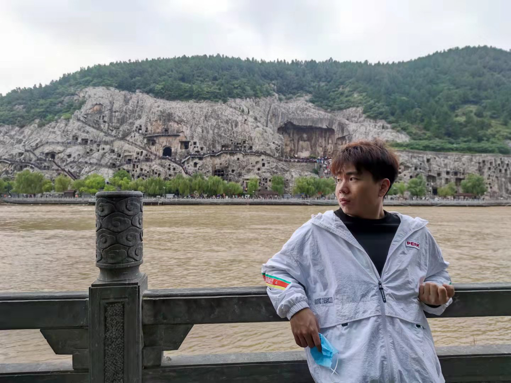

## Welcome to Xiao Yuan's Profile Page

* **Area / Home:** Beijing / Luoyang
* **Email:** [yuan_zhi_qiang@sina.cn](yuan_zhi_qiang@sina.cn)
* **Github:** [github.com/xiaoyuan1996](https://github.com/xiaoyuan1996)
* **CSDN:** [blog.csdn.net/Governer](https://blog.csdn.net/Governer)

**Intro:** Zhiqiang Yuan received the B.Sc. degree from Harbin Engineering University, Harbin, China, in 2019. He is pursuing
the Ph.D. degree with the Aerospace Information Research Institute, Chinese Academy of Sciences, Beijing, China.

His research interests include computer vision, pattern recognition, and remote sensing image processing, especially on cross-modal retrieval and image caption.

### Education Background
1. **2015 - 2019 年：**
      * 哈尔滨工程大学 通信专业 学士学位 学习排名：10/359 CET6: 529 
      * 主修课程：通信原理 数字信号处理 信号与系统 微机原理 随机信号分析 信息论 等

2. **2019 - 2020 年：** 
      * 中国科学院大学 信号与信息处理 博士在读 绩点：3.78/4
      * 主修课程：模式识别 图像处理 自然语言处理 数据挖掘 矩阵论 随机过程 等

3. **2020 年 - 至今：** 
      * 中国科学院电子所 信号与信息处理 博士在读 

### Papers

1. **Yuan, Z.**, Zhang, W., Fu, K., Li, X., Deng, C., Wang, H., & Sun, X. (2021). Exploring a Fine-Grained Multiscale Method for Cross-Modal Remote Sensing Image Retrieval. IEEE Transactions on Geoscience and Remote Sensing.

2. **Yuan, Z.**, Zhang, W., Rong, X., Li, X., Chen, J., Wang, H., Fu, K., & Sun, X. (2021). A Lightweight Multi-scale Crossmodal Text-Image Retrieval Method In Remote Sensing. IEEE Transactions on Geoscience and Remote Sensing.

3. **Yuan, Z.**, Li, S., Zhang, W., Du, R., Sun, X., & Wang, H. (2021). Speech Emotion Recognition Based on Secondary Feature Reconstruction. 6th IEEE International Conference on Computational Intelligence and Applications (ICCIA).

### Involved Projects

1. **2019 年：** 制作的 labview 教程获得将近 10 万学员：[www.51zxw.net/list.aspx?cid=757](https://www.51zxw.net/list.aspx?cid=757)
2. **2019 年：** 以负责人身份为开发了测控实验的一系列电路与 PPT
3. **2018 - 2019 年：** 跟随导师研发了柴油机可重构测试系统，在之中扮演了软件开发工程师的身份
4. **2017 - 2019 年：** 外包项目:
    * 基于 2.4G 与 GPRS 的分布式智能家居系统
    * 单相用电器分析监测装置
    * 基于视觉分析的智能分布式灯光控制系统
    * 基于树莓派的自动泄油计量系统
5. **2017 年：** 全国大学生创新创业项目——基于深度学习的网络入侵检测研究

### Rewards

1. **2020 年：** 科大讯飞 AI 开发者大赛多模态情感分析赛道 1/456
2. **2020 年：** 科大讯飞 AI 开发者大赛多语种文本挖掘赛道 2/230
3. **2017 年：** 全国大学生电子设计竞赛国家二等奖
4. **2017 年：** 第十五届挑战杯全国大学生课外学术科技作品国家三等奖
5. **2017 年：** 第十届全国大学生节能减排科技竞赛国家三等奖
6. **2017 年：** 黑龙江省挑战杯课外学术竞赛一等奖
7. **2017 年：** 黑龙江省 TI 杯电子设计竞赛一等奖
8. **2017 年：** 黑龙江省”互联网+“创新创业大赛二等奖
9. **2016 年：** 全国大学生数学建模竞赛黑龙江省一等奖
10. **2016 年：** 全国大学生数学竞赛黑龙江省一等奖
11. **2016 年：** 获得工信部创业奖学金二等奖

